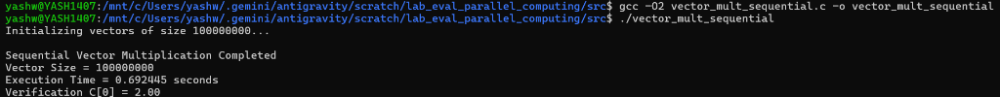
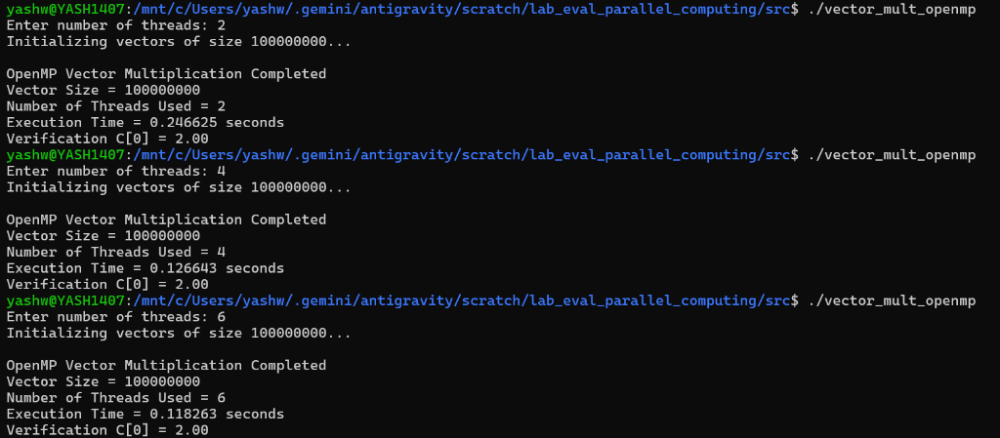
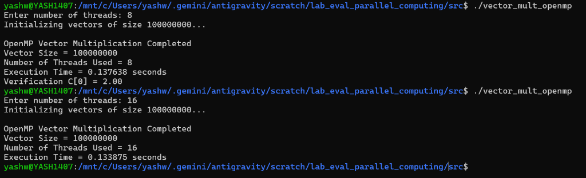
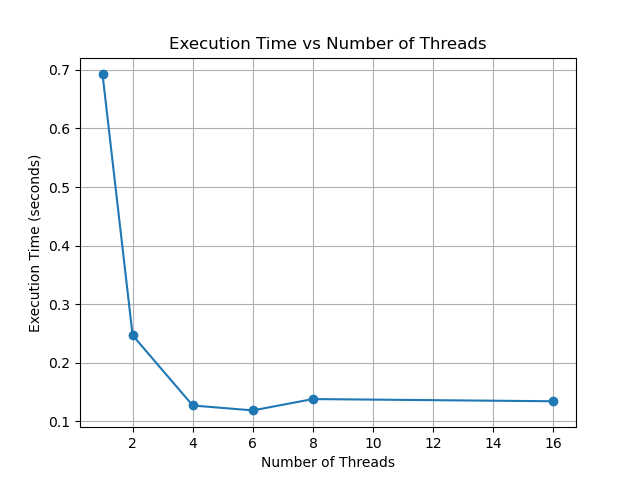
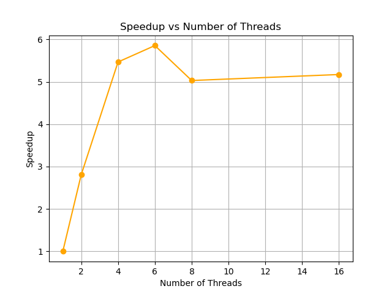
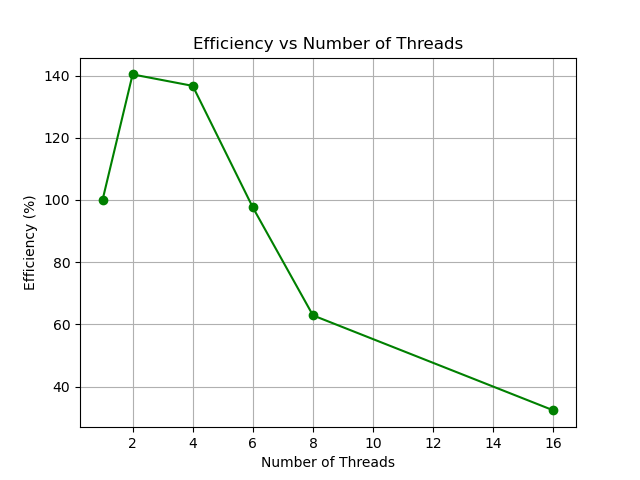

# Parallel Vector Multiplication using OpenMP

## 🎯 Checkpoint 1: Problem Definition & Design

### Problem Definition
We are tasked with performing **Parallel Vector Multiplication**. We take two very large arrays (vectors) of 100 million floating-point numbers each, and multiply them element-by-element to produce a third vector (`C[i] = A[i] * B[i]`). 

### Sequential Algorithm
The sequential approach uses a standard `for` loop that iterates through every single element one-by-one on a single CPU core. Since the vector size is 100 million, the single core must perform 100 million multiplications sequentially.

### Parallel Design
For the parallel design, we use **OpenMP** (Shared Memory Model). We apply the `#pragma omp parallel for` directive to the main multiplication loop. This instructs the compiler to automatically divide the 100 million iterations into equal chunks and distribute them across multiple CPU threads working simultaneously, dramatically reducing the overall execution time.

## 👥 Team Members
* [Yashwanth Reddy]
* [Abhinav Raj]
* [Yash raj]
* [Sushilendr Ekbote]

## 🛠️ Prerequisites
* **Linux Environment**: We used WSL (Windows Subsystem for Linux) Ubuntu.
* **GCC Compiler**: To compile the C code (`sudo apt install build-essential`).
* **OpenMP**: Already included with GCC compiler to write parallel code.
* **Python**: Used to plot the performance graphs automatically.

## 📂 Project Structure
* `src/` - Contains the `vector_mult_sequential.c` and `vector_mult_openmp.c` code files.
* `results/` - Contains our raw execution times stored in a `.csv` file.
* `graphs/` - Python script to plot data and the output images.
* `images/` - Screenshots of our program running in the terminal.
* `report/` - PDF report placeholder.
* `presentation/` - Lab evaluation PPT placeholder.

---

## 🚀 Checkpoint 2: Working Parallel Implementation

### 1. Sequential Baseline (Single Thread)
This program runs on a single core without parallelization.

```bash
# Navigate to the source folder
cd src

# Compile the code with -O2 optimization flag
gcc -O2 vector_mult_sequential.c -o vector_mult_sequential

# Run the compiled program
./vector_mult_sequential
```

**Terminal Output Screenshot:**


### 2. OpenMP Parallel Implementation (Multiple Threads)
This program uses the `#pragma omp parallel for` directive to automatically split the 100 million multiplications among multiple threads.

```bash
# Compile the code with the -fopenmp flag to enable OpenMP parallelization
gcc -O2 -fopenmp vector_mult_openmp.c -o vector_mult_openmp

# Run the compiled program (it will ask you how many threads to use)
./vector_mult_openmp
```

**Terminal Output Screenshots:**



---

## 📊 Checkpoint 3 & 4: Execution Results, Graphs, and Analysis

We ran the OpenMP version multiple times, increasing the number of threads each time.

### Results Table
| Threads | Execution Time (seconds) | Speedup (Seq_Time / Par_Time) |
| :---: | :---: | :---: |
| 1 (Sequential) | 0.692445 | 1.00x |
| 2 | 0.246625 | 2.80x |
| 4 | 0.126643 | 5.46x |
| 6 | 0.118263 | 5.85x |
| 8 | 0.137638 | 5.03x |
| 16 | 0.133875 | 5.17x |

### Graphs

Here are the visual representations of our performance (generated automatically using Python):

**1. Execution Time vs Threads**  
As we add more threads, the execution time drops rapidly before flattening out.


**2. Speedup vs Threads**  
The speedup is how many times faster the parallel code is compared to the sequential code.


**3. Efficiency vs Threads**  
Efficiency measures how well the threads are utilized. Adding too many threads can reduce efficiency due to overhead.


## 💡 Checkpoint 5: Final Demonstration & Viva Prep
* **Parallelism Works!** By using OpenMP to divide the work, we achieved a maximum speedup of **~5.85x** using 6 threads!
* **Diminishing Returns**: We noticed that adding threads beyond 6 did not make the program any faster. In fact, execution time increased slightly.
* **Why does this happen?** Vector multiplication is a very simple math operation, which means the CPU calculates it faster than the RAM can supply the data. This is called being **Memory Bandwidth Bound**. Furthermore, managing too many threads (like 16) introduces **Thread Overhead**, which reduces our efficiency. 
